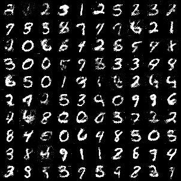

# Generative Adversarial Networks with Privacy and Collaboration

This project presents an  implementation of **Generative Adversarial Networks (GANs)** trained on MNIST, with advanced features for:

- **Differential privacy** via [opacus](https://opacus.ai)
- **Collaborative refinement** with sample perturbations
- **Latent space exploration** and interpolation techniques
- **Evaluation** using FID, F1 score, Precision, and Recall
- Reproducibility through CLI tools and structured logging

---

## Directory structure

```
GANs/
├── checkpoints/           # Saved models
├── assets/                # Grids for README
├── collab_mode.py         # Training function for collaborative mode
├── train.py               # Training loop (train | diff_privacy | collab modes)
├── generate.py            # Dirichlet or linear interpolations & grid sampling
├── evaluate.py            # F1 score + FID + Precision/Recall
├── models.py              # Generator & Discriminator
├── utils.py               # Training functions & model IO
└── datasets.py            # Custom dataset classes
```

---

## Running the code

### 1. Install dependencies

```bash
python -m venv venv
source venv/bin/activate
pip install -r requirements.txt
```

### 2. Train the model (three modes)

Standard GAN 
```bash
python train.py --mode train --epochs 75 --checkpoint checkpoint_GAN
```
With opacus differential privacy
```bash
python train.py --mode diff_privacy --epochs 20 --checkpoint checkpoint_DP
```
Training + perturbation-based collaborative refinement
```bash
python train.py --mode collab --epochs 50 --checkpoint checkpoint_collab
```

### 3. Generate samples (three modes)

Interpolated samples via latent Dirichlet
```bash
python generate.py --mode interpolate --interpolation_mode dirichlet
```
Linearly interpolated samples
```bash
python generate.py --mode interpolate --interpolation_mode linear
```
Grid of latent samples
```bash
python generate.py --mode grid
```
Random sampling
```bash
python generate.py --mode random --num_samples 10000
```

### 4. Evaluate model

```bash
python evaluate.py --checkpoint checkpoints --num_samples 1000
```

This computes:
- **Precision & Recall** using the trained Discriminator
- **F1 score**
- **FID** using [torchMetrics](https://torchmetrics.readthedocs.io)

---

## Key Features

- **Differential privacy**
  - Powered by [opacus](https://opacus.ai)
  - Ensures training with formal privacy guarantees

- **Collaborative refinement**
  - Perturbation learning to refine generated samples
  - Simulates semi-federated feedback

- **Latent space analysis**
  - Dirichlet interpolation across 10 latent vectors
  - Grid-based latent sample exploration

- **Evaluation**
  - FID, f1 score, precision, and recall computed

---

### Results comparison

| Model variant       | Generated samples                           | Latent interpolation                           |
|---------------------|---------------------------------------------|-------------------------------------------------|
| **GAN**             |          |          |
| **GAN + DP**        |            |            |
| **GAN + Collab**    |    |    |


---

| Metric             |      GAN  |   GAN with DP | GAN with collab
|--------------------|-----------|---------------|----------------------|
| FID (1000 samples) | ~0.0829   | ~1.1813       | ~0.2264
| Precision          | ~0.0588   | ~0.2719       | ~0.3834
| Recall             | ~0.7560   | ~0.6150       | ~0.9190
| F1 score           | ~0.1091   | ~0.3771       | ~0.5411


---

## References

- Y. Liu, P. Kothari, and A. Alahi, “Collaborative sampling in generative adversarial networks”, *Proceedings of the AAAI Conference on Artificial Intelligence*, vol. 34, no. 04, pp. 4948-4956, Apr. 2020.

- A. Bie, G. Kamath, and G. Zhang, *Private GANs, revisited*, 2023. arXiv: [2302.02936 [cs.LG]](https://arxiv.org/abs/2302.02936).

- A. Radford, L. Metz, and S. Chintala, *Unsupervised representation learning with deep convolutional generative adversarial networks*, 2015. arXiv: [1511.06434 [cs.LG]](https://arxiv.org/abs/1511.06434).

- T. Karras, S. Laine, and T. Aila, “A Style-Based Generator Architecture for Generative Adversarial Networks”, *IEEE Transactions on Pattern Analysis & Machine Intelligence*, vol. 43, no. 12, pp. 4217-4228, Dec. 2021.

---